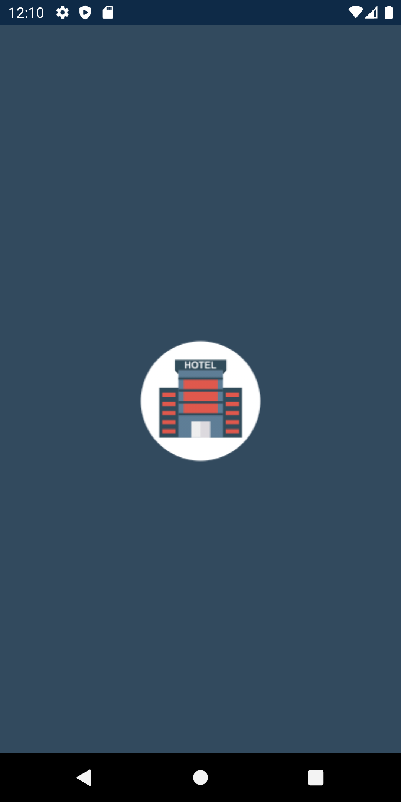
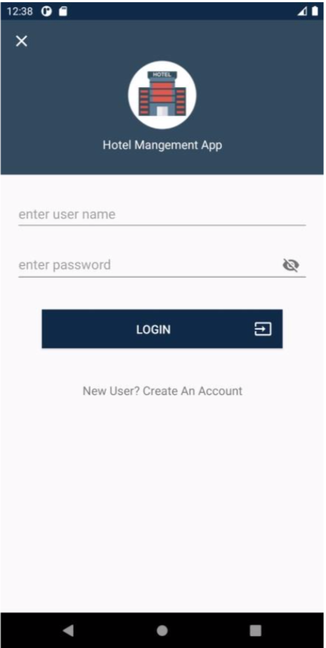
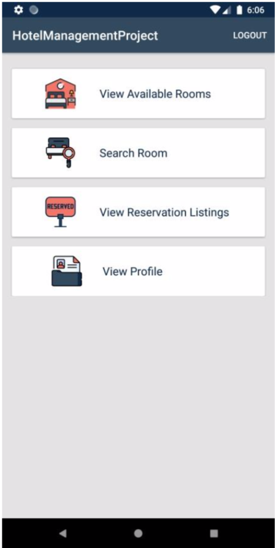
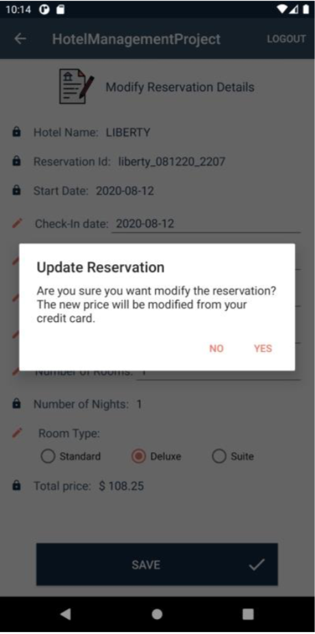

# Hotel Booking Application Developed with Software Engineering Design Principles

         

## Requirements. 
HotelBookingSystem where Guests can book hotel rooms. Managers are responsible for coordinating booking and Admin manages the system.
#### Hotel Manager - 
 This application user has the following functions:-
1. views listing of reservations
2. views details of a specific reservations
3. views available rooms on a given day/time
4. changes a room type
5. changes a room rate
6. makes a room unavailable
7. updates own profile
d8. oes not register - profile is already captured in system
#### Guest
1. registers
2. search for room type, number of rooms, number of adults/children, check-in and out date
3. reserves and pays for a room (credit card only - Mastercard, Visa, Discover)
4. view/modify/cancel reserved rooms
5. updates own profile
#### Admin
1. cannot update but can view own profile
2. does not register - profile is already captured in system
3. edits guest profile
4. remove a guest or manager from the system (user must re-register)

It takes  into consideration that a single user that has **_multiple roles_**, e.g. Guest and Manager would register twice with different usernames. Each user registers with at least a user name, role, credit card number, and personal details, contact information.

There are **5** Hotels all located in Arlington: **Maverick, Ranger, Williams, Shard, and Liberty**. All hotels have the same number of **rooms (100)** and **layout (4 floors - 1 through 4)**. Guests may book up to 4 rooms per booking - assume each booking is only for rooms of the same type. **Tax** is **8.25%**

### Project uses
* Android Studio
* SQLite (DB on local Android not on server) 
# Software Engineering Techinques/Priciples Applied:
1. Acquiring Requirements
2. Deriving Use Cases from Requirements
3. Allocating Use Cases & Subsystems
to Iterations
4. Producing an Architecture Design
5. Domain Modeling
6. Actor-System Interaction Modeling & UI Design
7. Behavior Modeling & Responsibility Assignment
8. Deriving Design Class Diagram
9.  Test Driven Development, Integration, & Deployment

* **Readme.md file  briedfly describes about the requirements gathered
* **UCID function table: [click here to view](UCID.xlsx)
* **Use Case Diagram: [click here to view](UseCaseDiagram.pdf)
* **Domain Model Diagram: [click here to view](DomainDiagram.pdf)
* **UI Prototypes: [click here to view](UIPrototypes.pdf)
* **Expanded UseCases diagram: [click here to view](ExpandedUseCaseDiagram.pdf)
* **Sequence Diagram: [click here to view](SequenceDiagram.pdf)
* **Design Class Diagram: [click here to view](DesignClassDiagram.pdf)

